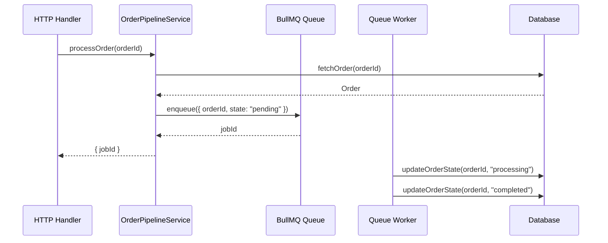
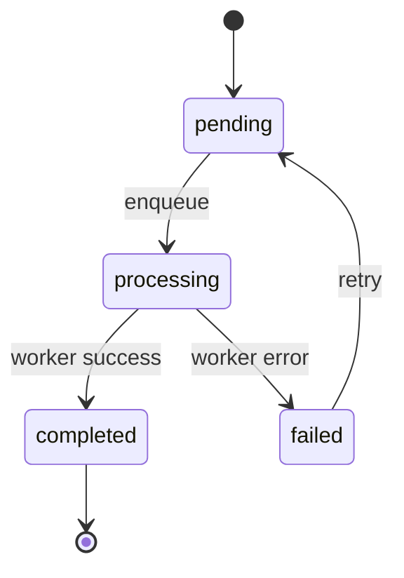

# Sample Plan — G19 Mermaid-Flow Pass Fixture

This fixture exercises the G19 render-don't-narrate gate's explicit carve-out for Mermaid fenced blocks on flow / call-order / state surfaces (catalog #4/#5/#6).

- **Task 1** — an order-pipeline task that touches a call-order surface (catalog #4) and an order state machine (catalog #5/#6). It renders BOTH surfaces using Mermaid fenced blocks (`sequenceDiagram` + `stateDiagram-v2`). G19 must **PASS** Task 1 — a Mermaid-rendered flow is a valid render, not narration.

---

# Order Pipeline Plan

**Goal:** Add an order processing pipeline with explicit call order and lifecycle state machine.
**Architecture:** Service layer; async queue-backed state transitions.
**Source:** conversation context
**Verification:** npm test

---

## Deviations & assumptions

| Item | asked | does | why |
|------|-------|------|-----|
| Async queue | "process orders" | uses BullMQ queue | decouples HTTP response from slow payment calls |

---

### Key Decisions

- KD1: Use BullMQ for async order processing to avoid blocking HTTP responses.
- KD2: State transitions enforced in domain layer, not route handler.

---

### Task 1: Order pipeline call order + state machine

**Complexity:** Standard
**Risk:** Medium
**Depends on:** none
**Verify:** tests

**Files:**
- Create: `src/services/order-pipeline.ts`
- Test: `tests/services/order-pipeline.test.ts`

**Contract:**
- shape (code): `processOrder(orderId: string): Promise<OrderResult>`; throws `OrderNotFoundError` | `InvalidStateTransitionError`; reads from `process.env.QUEUE_URL`.
- names: `processOrder`, `OrderResult`, `OrderNotFoundError`, `InvalidStateTransitionError`.
- mirror: existing service style at `src/services/payment.ts:1-40`.
- decisions: KD1, KD2.
- sync: `src/middleware/auth.ts` guards the trigger endpoint — no auth changes needed.

**Rendered artifacts:**

Call order for `processOrder` (catalog #4 — call-order surface, Mermaid sequenceDiagram):

Order lifecycle state machine (catalog #5/#6 — state surface, Mermaid stateDiagram-v2):

**Acceptance criteria:**
- [ ] `processOrder` enqueues the order and returns a `jobId`
- [ ] Worker transitions order through `pending → processing → completed`
- [ ] Failed jobs transition to `failed` and are retryable
- [ ] `OrderNotFoundError` thrown when `orderId` does not exist
