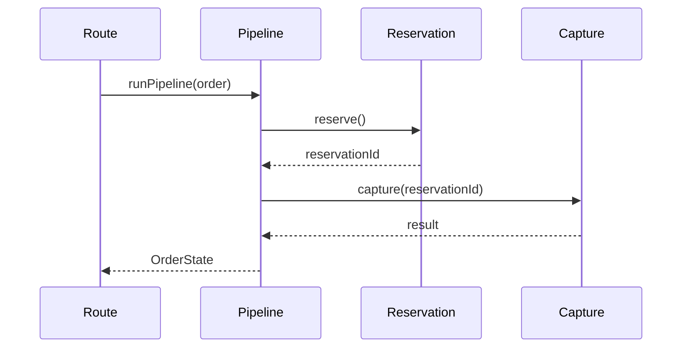
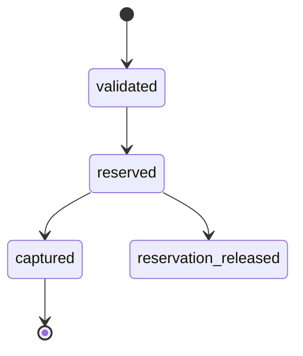

# Sample Plan — Mermaid-allowed render surfaces (Fixes #472)

This fixture is a **code** plan. It exercises R50 (Mermaid fenced blocks allowed for
flow / call-order / state surfaces; no MDX) and R49 (one elided `…` example per distinct
contract shape) under the G19 render-don't-narrate gate, now error-severity / blocking.

- **Task 1** — a call-order + state-machine task that RENDERS its flow surface as a Mermaid
  fenced block (sequence diagram for call order, state diagram for the order lifecycle).
  G19 must PASS it — Mermaid is an allowed render form for flow/call-order/state surfaces.
- **Task 2** — a payload task that touches a single status enum across two endpoints. It
  renders ONE elided (`…`) example for the shared shape, not one per endpoint. This
  satisfies the per-distinct-shape cap (R49).

---

# Order Pipeline Plan

**Goal:** Add an order-processing pipeline with a typed state machine and a shared status enum across the create and update endpoints.
**Architecture:** Pipeline service orchestrates validation → reservation → capture; status enum is a shared string union consumed by both routes.
**Source:** conversation context
**Verification:** npm test

---

## Deviations & assumptions

| Item | asked | does | why |
|---|---|---|---|
| state machine | "process orders" | adds an explicit `OrderState` machine | request implied lifecycle but did not name states |

---

### Task 1: Order pipeline call order + state machine

**Complexity:** Complex
**Risk:** Medium
**Depends on:** none
**Verify:** tests

**Files:**
- Create: `src/pipeline/order-pipeline.ts`
- Test: `tests/pipeline/order-pipeline.test.ts`

**Notes:** (optional — rationale only, ≤5 lines; the "what" lives in Files/Contract/Acceptance)
Sequenced as validate → reserve → capture so a failed capture leaves the reservation releasable.

**Acceptance criteria:**
- [ ] Pipeline runs validate → reserve → capture in order
- [ ] A capture failure transitions the order to `reservation_released`, never `captured`
- [ ] State transitions follow the rendered state machine

**Contract:**
- shape (code): `runPipeline(order: Order): Promise<OrderState>`; throws `ReservationError` | `CaptureError`.
- names: `runPipeline`, `OrderState`, `ReservationError`, `CaptureError`.
- mirror: existing service style at `src/pipeline/payment-pipeline.ts:1-60`.
- decisions: state machine owns transition validation; routes call `runPipeline` only.
- sync: shared `OrderStatus` enum with Task 2.

**Rendered artifacts:**

Call order (artifact #4 — Mermaid sequence, allowed for call-order surface):



Order lifecycle (artifact #5 — Mermaid state diagram, allowed for state surface):



---

### Task 2: Shared status enum across create + update routes

**Complexity:** Standard
**Risk:** Low
**Depends on:** Task 1
**Verify:** tests

**Files:**
- Modify: `src/routes/orders-create.ts` — emit `OrderStatus` in the response body
- Modify: `src/routes/orders-update.ts` — accept `OrderStatus` in the request body
- Test: `tests/routes/orders-status.test.ts`

**Notes:** (optional — rationale only, ≤5 lines; the "what" lives in Files/Contract/Acceptance)
Both routes share one status shape; rendered once, not duplicated per endpoint.

**Acceptance criteria:**
- [ ] Both routes use the same `OrderStatus` union
- [ ] Invalid status returns 400 on the update route

**Contract:**
- shape (code): `type OrderStatus = "pending" | "reserved" | "captured" | "released"`.
- names: `OrderStatus`.
- mirror: shared enum from Task 1's `OrderState`.
- decisions: one shared union, not per-route copies.
- sync: `OrderState` (Task 1).

**Rendered artifacts:**

Status payload (artifact #1 — one elided `…` example for the shared shape, per R49):

```json
// Shared OrderStatus shape (both create response and update request)
{
  "id": "ord-123",
  "status": "reserved",
  "…": "(other order fields elided)"
}
```
